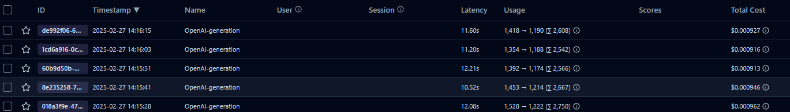

# Feature Extraction System

A Python-based system that extracts structured features from product descriptions using Large Language Models (LLM).

## Overview

This system processes product descriptions and extracts specific features using LLM capabilities. It handles various data types including:
- Numeric values with units (dimensions, weights, temperatures, etc.)
- Connection types and sizes (R 3/4", DN80, etc.) 
- Boolean features (yes/no values)
- Categorical values (fuel types, materials, etc.)

## Requirements

- Python 3.10 or higher
- OpenAI API key
- Dependencies listed in pyproject.toml

## Setup

1. Clone the repository

2. Create a virtual environment:

```bash
python -m venv venv
source venv/bin/activate
```
3. Install poetry:

```bash
curl -sSL https://install.python-poetry.org | python3 -
```

4. Install dependencies:

```bash
cd feature-extraction
poetry install
```

5. Create a `.env` file in the root directory with the following variables:

```bash
OPENAI_API_KEY=your_openai_api_key
OPENAI_MODEL=gpt-4o-mini
# Optional: Langfuse credentials only needed to trace and
LANGFUSE_PUBLIC_KEY=your_langfuse_public_key
LANGFUSE_SECRET_KEY=your_langfuse_secret_key
LANGFUSE_HOST=your_langfuse_host
```

## Usage

1. Place your data files in the `data_source` directory:
   - Product descriptions as `product_*.txt` files
   - Feature list as `features.txt`

2. Run the feature extraction:

```bash
python src/feature_extraction/extract_features.py
```

3. Find results in the `output` directory:
   - Individual product features as separate XLSX files
   - Combined results in `all_products.xlsx`


## Project Tree

```
feature-extraction/
├── src/
│   └── feature_extraction/
│       ├── extract_features.py   # Core extraction logic
│       ├── load_text_files.py    # Data loading utilities
│       └── llm_config.py         # LLM configuration
├── data_source/                  # Input data directory
└── output/                      # Results directory
```

## Key Components

### extract_features.py
- Main feature extraction logic
- Handles LLM prompting and response parsing
- Normalizes extracted values
- Saves results to XLSX files

### load_text_files.py
- Loads feature list and product descriptions
- Handles file reading and text processing

### llm_config.py
- Manages OpenAI API configuration
- Handles LLM interactions

## Value Normalization

The system automatically normalizes extracted values:
- Strips units from measurements
- Standardizes connection types
- Converts text to proper boolean values
- Handles ranges and multiple values
- Standardizes fuel type names

## Error Handling

The system includes robust error handling for:
- Invalid JSON responses
- Missing or malformed data
- Unit conversion issues
- File I/O operations

## Data Format

### Input
- Product descriptions: Free-form text files
- Features list: One feature name per line

### Output
- Excel files with normalized feature values
- Consistent data types for each feature
- Null values for missing features


## Cost Tracking

The system uses the OpenAI API to extract features. The cost of the API calls is tracked using the Langfuse API.
Model: gpt-4o-mini



